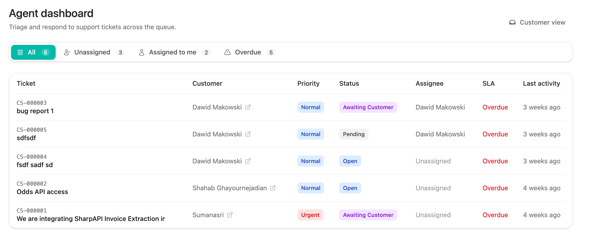
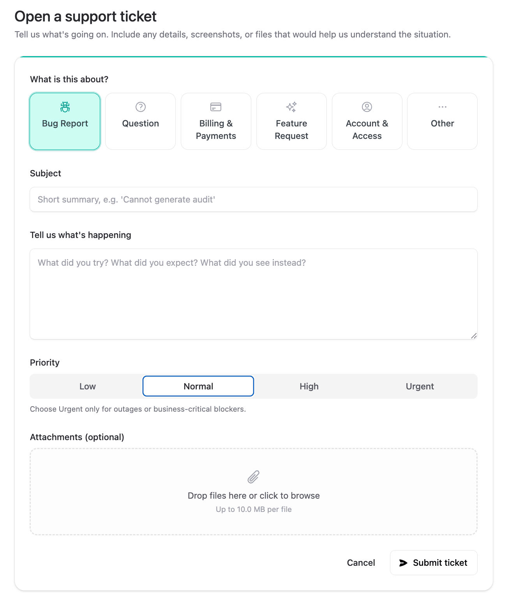
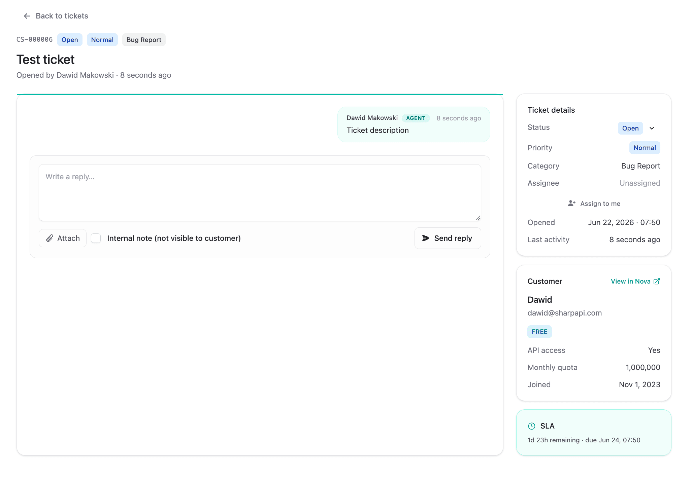
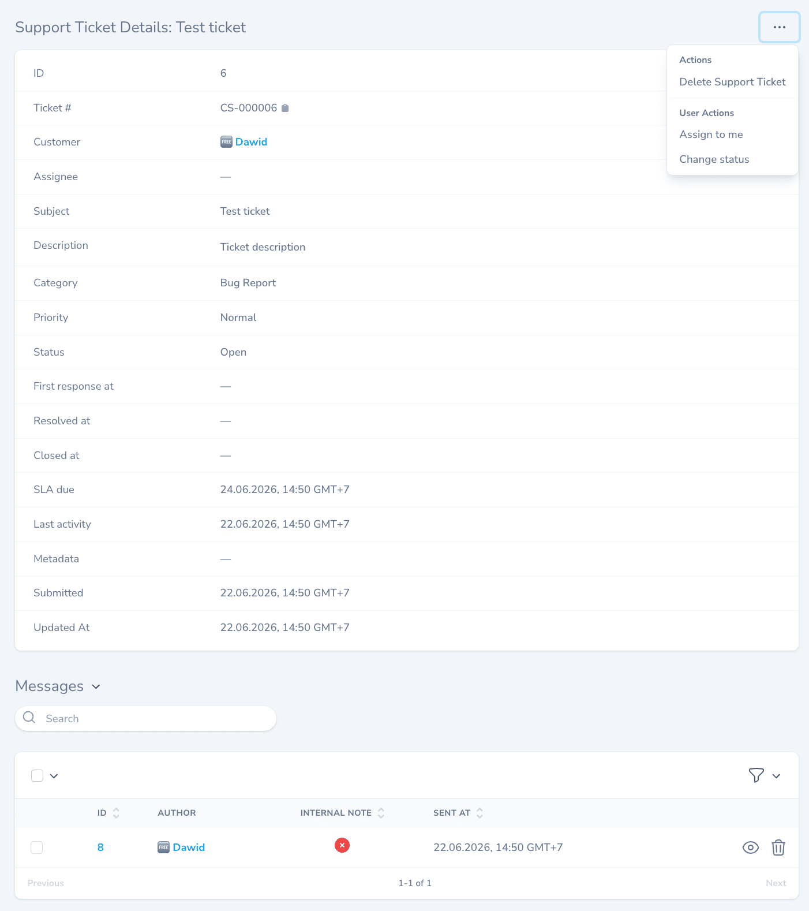

# Laravel Customer Support

[](https://packagist.org/packages/a2zwebltd/laravel-customer-support)
[](https://packagist.org/packages/a2zwebltd/laravel-customer-support)
[](LICENSE)

A portable Laravel customer-support / helpdesk engine — tickets with threaded replies, attachments, internal notes, agent assignment, SLA tracking, mail notifications, a Livewire + Flux UI, and Nova admin resources.

Designed to drop into any Laravel app with minimal wiring while remaining fully customisable.

## Screenshots

| Agent dashboard | New ticket |
|---|---|
|  |  |

| Ticket details | Nova admin |
|---|---|
|  |  |

## Requirements

- PHP 8.2+
- Laravel 11 / 12 / 13
- `livewire/livewire` ^3 or ^4 (for the bundled UI)
- `livewire/flux` ^2 (recommended — Blade templates use Flux components)
- `spatie/laravel-medialibrary` ^11 (attachments)
- `laravel/nova` ^5 (optional — auto-registers Nova resources when present)

## Installation

```bash
composer require a2zwebltd/laravel-customer-support
php artisan migrate
php artisan vendor:publish --tag=customer-support-config   # optional
```

Add the trait to your `User` model:

```php
use A2ZWeb\CustomerSupport\Concerns\HasSupportTickets;

class User extends Authenticatable implements HasMedia
{
    use HasSupportTickets;
}
```

Define the agent gate in `AppServiceProvider::boot()`:

```php
Gate::define('manage-support-tickets', fn (User $user) => $user->is_admin);
```

## Features

- Ticket statuses: Open, Pending, In Progress, Awaiting Customer, Resolved, Closed
- Priorities: Low / Normal / High / Urgent — each with configurable SLA hours
- Configurable categories
- Threaded replies (`SupportTicketMessage`)
- Internal notes (visible only to agents)
- Attachments via `spatie/laravel-medialibrary` (on tickets and messages)
- Agent assignment with `assigned_to`
- SLA timer (`due_at`) + `EscalateOverdueTickets` console command for cron escalation
- Mail notifications: created / replied / status-changed / resolved (markdown, queueable)
- Domain events: `TicketCreated`, `TicketReplied`, `TicketStatusChanged`, `TicketAssigned`
- Policies on ticket + message resources
- Livewire + Flux UI (teal accent, dark-mode aware)
- Nova resources auto-registered when Nova is installed

## Routes

| Method | URI | Name |
|--------|-----|------|
| GET | `/support` | `support.index` |
| GET | `/support/new` | `support.create` |
| GET | `/support/{ticket}` | `support.show` |
| GET | `/support/admin` | `support.admin.dashboard` |

(Prefix and middleware configurable in `config/customer-support.php`.)

## Configuration

See `config/customer-support.php`. Highlights: `user_model`, `routes`, `admin_gate`, `categories`, `sla_hours`, `mail.admin_recipients`, `attachments`, `theme.accent`.

## Cron

```php
// routes/console.php
use Illuminate\Support\Facades\Schedule;

Schedule::command('support:escalate-overdue')->hourly();
```

## Testing

```bash
composer test
```

---
## Security Vulnerabilities

If you discover a security vulnerability, please report it responsibly through private communication with the maintainers.

---
## License

The MIT License (MIT). Please see [License File](LICENSE) for more information.

## Credits

Developed and maintained by the **A2Z WEB** crew:
* [Dawid Makowski](https://github.com/makowskid)
* Website: [https://a2zweb.co/](https://a2zweb.co/)
* GitHub: [https://github.com/a2zwebltd/](https://github.com/a2zwebltd/)
